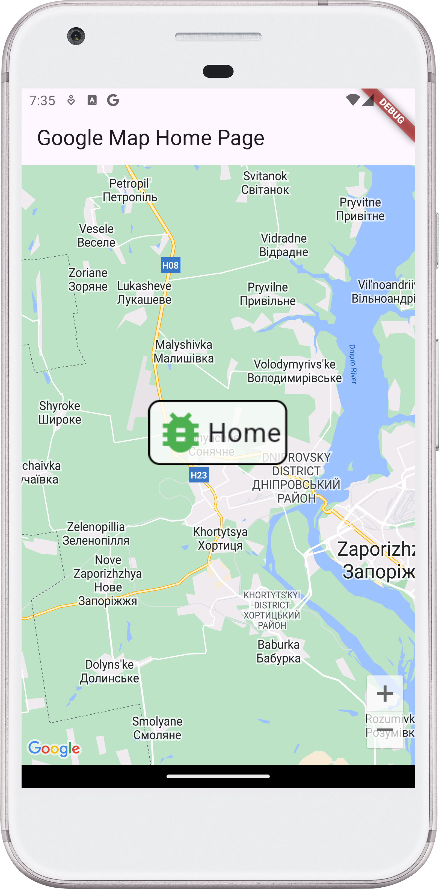
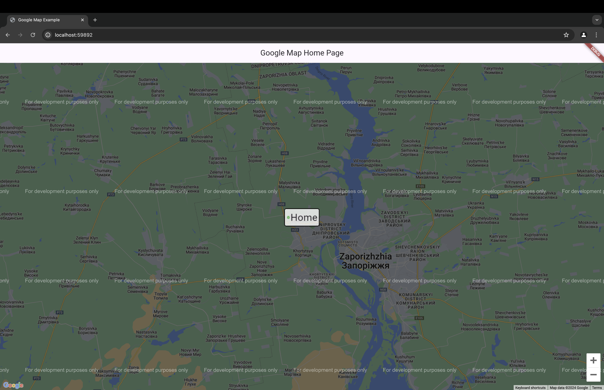

# Google Map Flutter

## Project Description

The Google Map Flutter project is a sample Flutter application demonstrating
the usage of Google Maps with custom markers. The app features a single screen
with a map and a custom marker at a specific geographic location. The marker
remains fixed in the center of the map as the map is moved or zoomed. This
project is primarily educational, showcasing how to integrate Google Maps into
a Flutter app and customize markers.

## Features

- **Map Screen**: Displays a Google Map with a custom marker at a hardcoded
  location.
- **Custom Marker**: The marker is a rectangular shape with rounded corners and
  does not change size when the map is zoomed.
- **Marker Interaction**: The marker remains fixed in the center of the map as
  the map is moved.
- **Code Readability:** code is easily readable with no unnecessary blank lines,
  no unused variables or methods, and no commented-out code, all variables,
  methods, and resource IDs are descriptively named such that another developer
  reading the code can easily understand their function.

## Installation Instructions

1. Download the project.
2. Open the project in your preferred IDE (e.g., Android Studio, VS Code).
3. Run the project on an emulator or physical Android device, or on the web (iOS
   not implemented).

## Usage

Once installed, developers can observe how the app works and use the
functionality in real projects where similar functionality is needed. The
primary purpose of the app is educational, demonstrating the usage of Google
Maps with custom markers in Flutter.

## Technologies Used

- **google_maps_flutter**: Google Maps plugin for Flutter.
- **google_maps_flutter_web**: Google Maps plugin for Flutter web.
- **after_layout**: Flutter package for executing code after the first layout.
- [Flutter](https://flutter.dev/): UI toolkit for building natively compiled
  applications.
- [Dart](https://dart.dev/): Programming language for Flutter.
- **Monolith Architecture**:
  [Monolithic application](https://en.wikipedia.org/wiki/Monolithic_application).

## Contributing

Anyone can contribute by creating a pull request with changes. Contributions
are welcome, although the app is primarily for educational purposes.

## Credits

This project may have been inspired by documentation or random available code
on the internet, but the specific source is not remembered.

## License

This project does not have an intentional license.

## Contact:

For any inquiries or suggestions, please open an issue on the GitHub repository
or reach out to me directly at
[support@turskyi.com](mailto:support@turskyi.com).

## Screenshots:

<!--suppress CheckImageSize -->

